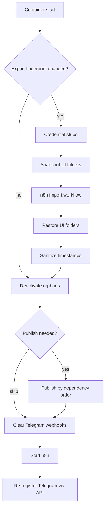

# n8n-auto-import

**GitOps-style workflow sync for n8n** — import workflow JSON from git on every container start, publish active workflows in dependency order, and keep Telegram triggers healthy after restarts.

No manual UI sync. Your git export is the source of truth.

---

## Why

Running n8n in Docker makes workflow state easy to drift:

- Edits in the UI are lost on the next deploy unless you re-export.
- Stale workflows stay active in SQLite and steal webhooks.
- `n8n publish:workflow` updates the DB but does not always re-register Telegram webhooks.
- Corrupt `createdAt` timestamps can crash the Workflows UI.

This entrypoint wrapper runs a deterministic pipeline **before** n8n starts, then optionally re-registers Telegram triggers **after** `/healthz` is up.

---

## Features

| Feature | What it does |
|---------|--------------|
| **Fingerprint skip** | SHA-256 of all export JSON — skip import when nothing changed (fast restarts) |
| **Credential stubs** | Creates empty credentials for missing `(type, name)` pairs; never overwrites secrets |
| **Folder preservation** | Snapshots/restores UI `parentFolderId` around import (folders are not in git) |
| **Timestamp sanitize** | Fixes invalid `createdAt`/`updatedAt` in SQLite (prevents UI crash) |
| **Orphan cleanup** | Deactivates active workflows not present in the export |
| **Ordered publish** | Publishes `active: true` workflows sub-workflow → caller (topological sort) |
| **Batch publish** | Single Node process via `WorkflowRepository.publishVersion` (faster than N× CLI) |
| **Telegram fix** | Clears webhooks pre-start; live deactivate+activate via Public API post-start |

---

## How it works

On every container start, [`n8n_entrypoint.sh`](n8n_entrypoint.sh) runs:

1. **Fingerprint** — compare hash of `*.json` in the workflows dir; skip import if unchanged (unless forced).
2. **Credential stubs** — [`n8n_ensure_credential_stubs.js`](n8n_ensure_credential_stubs.js).
3. **Folder snapshot** — [`n8n_preserve_folders.js`](n8n_preserve_folders.js) `snapshot`.
4. **`n8n import:workflow --separate`** — load workflows from the mounted export directory.
5. **Folder restore** — put workflows back into their UI folders.
6. **Sanitize timestamps** — [`n8n_sanitize_timestamps.js`](n8n_sanitize_timestamps.js).
7. **Publish pass** (always evaluated):
   - Deactivate orphan workflows — [`n8n_deactivate_orphans.js`](n8n_deactivate_orphans.js).
   - Skip publish if export unchanged and DB already has `activeVersionId` — [`n8n_publish_needed.js`](n8n_publish_needed.js).
   - Otherwise publish by dependency level — [`n8n_publish_order.js`](n8n_publish_order.js) + [`n8n_publish_batch.js`](n8n_publish_batch.js) (CLI fallback available).
8. **Clear Telegram webhooks** — [`n8n_clear_telegram_webhooks.js`](n8n_clear_telegram_webhooks.js).
9. **Start n8n** — delegate to the original Docker entrypoint.
10. **Re-register Telegram** (background) — [`n8n_reregister_telegram.js`](n8n_reregister_telegram.js) after `/healthz` (requires `N8N_API_KEY`).



Import errors are logged; n8n still starts (production should not die on one bad JSON file).

---

## Quick start

### 1. Get the scripts

```bash
git clone https://github.com/olegfour3/n8n-auto-import.git
```

Or add as a submodule in your project:

```bash
git submodule add https://github.com/olegfour3/n8n-auto-import.git scripts/n8n-auto-import
```

### 2. Export workflows to git

From a running n8n instance (or inside the container):

```bash
n8n export:workflow --all --separate --output=./workflows
```

Commit one JSON file per workflow. Keep stable workflow `id` values across environments.

### 3. Wire Docker Compose

Mount three volumes and replace the entrypoint — see [`examples/docker-compose.snippet.yml`](examples/docker-compose.snippet.yml):

```yaml
entrypoint: ["tini", "--", "/bin/sh", "/n8n-import-scripts/n8n_entrypoint.sh"]
volumes:
  - ./n8n_data:/home/node/.n8n
  - ./workflows:/workflows:ro
  - ./scripts/n8n-auto-import:/n8n-import-scripts:ro
```

Restart n8n and watch logs:

```bash
docker compose logs n8n 2>&1 | grep 'n8n-auto-import'
```

---

## Configuration

| Variable | Default | Description |
|----------|---------|-------------|
| `N8N_AUTO_IMPORT_WORKFLOWS` | `true` | Master switch for the import pipeline |
| `N8N_AUTO_IMPORT_FORCE` | `false` | Ignore fingerprint; force full reimport |
| `N8N_WORKFLOWS_IMPORT_DIR` | `/workflows` | Directory with `*.json` workflow exports |
| `N8N_IMPORT_SCRIPTS_DIR` | `/n8n-import-scripts` | Path to this repo inside the container |
| `N8N_IMPORT_FINGERPRINT` | `~/.n8n/.n8n-auto-import-workflows-fingerprint` | Saved import hash |
| `N8N_ALWAYS_PUBLISH_ON_START` | `true` | Run publish pass on every start |
| `N8N_FORCE_PUBLISH_ON_START` | `false` | Always publish; ignore publish fingerprint |
| `N8N_PUBLISH_FINGERPRINT_FILE` | `~/.n8n/.n8n-auto-import-publish-fingerprint` | Saved publish hash |
| `N8N_PUBLISH_USE_BATCH` | `true` | Use single-process batch publish |
| `N8N_PUBLISH_USE_CLI_FALLBACK` | `true` | Fall back to `n8n publish:workflow` per id |
| `N8N_PUBLISH_PARALLEL` | `4` | Parallelism for CLI fallback within a level |
| `N8N_CLEAR_TELEGRAM_WEBHOOKS` | `true` | Pre-start `deleteWebhook` for active triggers |
| `N8N_API_KEY` | — | Public API key for live Telegram re-register |
| `N8N_REREGISTER_TELEGRAM` | `true` | Post-start deactivate+activate via API |
| `N8N_REREGISTER_WAIT_SEC` | `90` | Max wait for `/healthz` |
| `N8N_DATABASE_SQLITE` | `~/.n8n/database.sqlite` | SQLite path for direct DB scripts |

Kill-switch examples:

```yaml
environment:
  - N8N_AUTO_IMPORT_WORKFLOWS=false      # disable entire sync
  - N8N_ALWAYS_PUBLISH_ON_START=false    # skip publish pass
  - N8N_REREGISTER_TELEGRAM=false        # skip live Telegram re-register
```

---

## Workflow export conventions

- **One file per workflow** — `--separate` export layout.
- **Stable `id`** — same workflow id in dev/staging/prod; n8n remaps on import by id.
- **`active: true/false`** — controls which workflows get published on start.
- **Sub-workflows** — `Execute Workflow` targets are published before callers automatically.

**Source of truth:** git export. UI-only edits without re-export are overwritten on the next restart.

---

## Credentials

Secrets are **not** stored in git.

Before import, the stub script scans workflow JSON for credential references and creates missing accounts with empty payloads matched by `(type, name)`. Existing credentials are never overwritten — fill secrets once in the n8n UI.

n8n remaps credential ids on import using `(name, type)`.

---

## UI folders

Workflow folder layout in the n8n UI is **not** part of the JSON export. The preserve/restore step keeps local `parentFolderId` assignments across imports.

---

## Telegram triggers

Two-step fix for “trigger shows active but messages never arrive” after nightly restarts:

1. **Pre-start** — `deleteWebhook` for bots used by active `telegramTrigger` workflows.
2. **Post-start** — deactivate + activate those workflows via Public API so `setWebhook` runs in the live process (same as manual UI publish).

`n8n publish:workflow` only writes to the database; it does not call Telegram. Set `N8N_API_KEY` (Settings → API in n8n) for step 2.

---

## Troubleshooting

**See pipeline phases and timing:**

```bash
docker compose logs n8n 2>&1 | grep -E 'n8n-auto-import|phase '
```

**Force full reimport:**

```yaml
- N8N_AUTO_IMPORT_FORCE=true
```

**Force full publish:**

```yaml
- N8N_FORCE_PUBLISH_ON_START=true
```

**Workflows UI crashes with `createdAt.toString`:** timestamp sanitize runs on import; force reimport if the DB was corrupted before this tool was added.


---

## Updating (git submodule consumers)

```bash
git submodule update --remote scripts/n8n-auto-import
git commit -am "chore: bump n8n-auto-import"
```

Fresh clones need submodules initialized:

```bash
git clone --recurse-submodules <your-project>
# or
git submodule update --init --recursive
```

---

## License

MIT — see [LICENSE](LICENSE).
